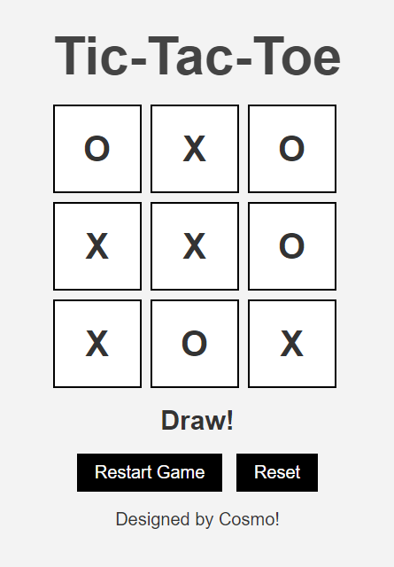

# PRODIGY_WD_03

Welcome to **Interactive Tic-Tac-Toe Web Application 🎮**, an engaging and interactive Tic-Tac-Toe web application. This project brings the classic game of Tic-Tac-Toe to the web, allowing users to play against each other or challenge a dynamic AI opponent. Built with HTML, CSS, and JavaScript, this game provides a fun and competitive experience with modern web technologies.

## 🌟 Project Overview

This Tic-Tac-Toe web application offers:

- **Player vs. Player Mode**: Two players can compete head-to-head in a classic match of Tic-Tac-Toe.
- **AI Opponent Mode**: Challenge a smart AI opponent that adapts to different difficulty levels.
- **Dynamic Game State Tracking**: Real-time updates and visual feedback for each move.
- **Winning Condition Check**: Automatic detection of winning combinations or draws.

## 🛠️ Features

- **Responsive Design**: The game board adjusts seamlessly across various screen sizes, ensuring an enjoyable experience on both mobile and desktop devices.
- **Interactive Gameplay**: Intuitive click-based controls make gameplay smooth and engaging.
- **AI Integration**: Play against an AI that ranges from beginner to unbeatable.

## 📂 Project Structure

```graphql
├── index.html          # Main HTML structure
├── styles.css          # CSS styling for the game
├── script.js           # JavaScript for game logic and AI functionality
└── /img                # Folder for any additional assets (e.g., images, icons)
```

## 🚀 Getting Started

To get the Tic-Tac-Toe game up and running on your local machine, follow these steps:

1. **Clone the repository**:
   ```bash
   git clone https://github.com/Mayur-Mhatre/PRODIGY_WD_03.git
   ```
2. **Navigate to the project directory**:
   ```bash
   cd PRODIGY_WD_03
   ```
3. **Open `index.html`** in your preferred web browser to start the game.

## 🔧 How It Works

- **HTML**: Provides the basic structure of the game board and interface elements.
- **CSS**: Styles the game board and ensures a responsive, visually appealing layout.
- **JavaScript**: Powers the game logic, handling user interactions, tracking the game state, and implementing AI behavior.

## 🎨 Screenshots

  
*Example of the Tic-Tac-Toe game interface.*

## 📝 License

This project is licensed under the **GPL-3.0 License**. See the [LICENSE](LICENSE) file for more details.

## 🙌 Acknowledgements

- Developed as part of the PRODIGY Web Development Series.
- Inspired by the classic game of Tic-Tac-Toe, brought to the web with modern technologies.

## 👤 About the Author

**Mayur Mhatre**

- **GitHub**: [Mayur-Mhatre](https://github.com/Mayur-Mhatre/)
- **LinkedIn**: [Mayur Mhatre](https://www.linkedin.com/in/mayurmhatre/)

Feel free to reach out or connect if you have any questions or suggestions!

---

Thank you for checking out **PRODIGY_WD_03**! Contributions, feedback, and suggestions are always welcome. Let's make this game even better together!
